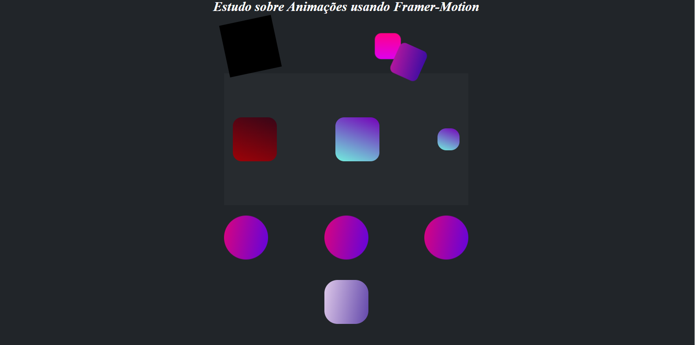
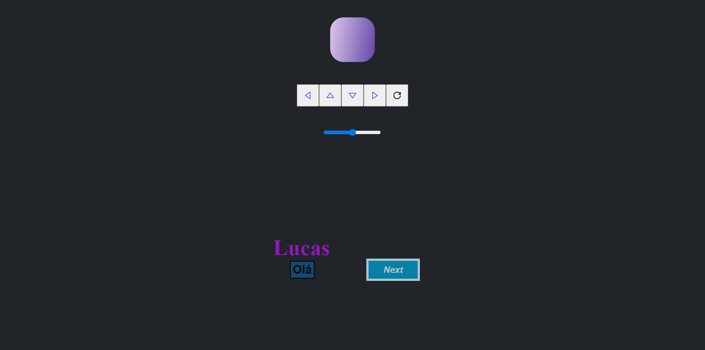
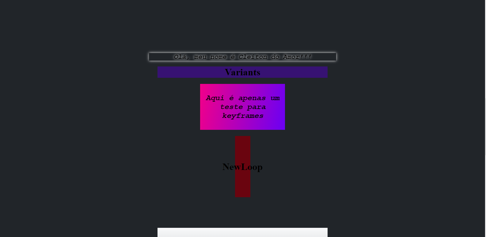

# Estudos Aprofundados em Framer_Motion

## Esse projeto contém varias funções e atributos do framer-motion. Na pasta pages possui apenas uma pagina que contém todas as animações. As principais animações estão divididas em componentes, eles estão na pasta components.

### Descrição:

Pasta data contém o arquivo DataAnimation.ts, nele tem um array de objetos.

O projeto é dividido em alguns blocos onde cada um tem um efeito diferente.

#### * Primeiro Bloco:



Os três primeiros blocos estão na pasta Block, onde eles são orientados pelos comandos:
```markdown
initial={{ scale: 0 }}
animate={{ rotate: 90, scale: 1.5 }}
transition={{
   type: "spring",
   stiffness: 100,
   damping: 80
}}
```

Cada bloco tem uma posição inicial onde pode ser alterado pelo initial.

Os próximos blocos contêm animações pré-definidas, além disso, possuem animações para serem arrastadas e quando o mouse está sobre o bloco.

Hover:

```markdown
whileHover={{ scale: 1.2, rotate: 90 }}
whileTap={{
    scale: 0.8,
    rotate: -90,
    borderRadius: "100%"
}}
```

Drag:

```markdown
drag
dragConstraints={{
    top: -20,
    left: -20,
    right: 20,
    bottom: 20,
}}
```

Os círculos têm apenas uma animação simples que é ativada quando a página é carregada.

#### * Segundo Bloco:



No segundo bloco tenho duas animações diferentes.

O primeiro é modelado pelo arquivo na pasta BlockMov onde o bloco é controlado pelos comandos abaixo. As setas controlam a direção do objeto, a barra de raiva controla o tamanho e o botão recarregar redefine as propriedades do bloco.

O segundo consiste em "abrir" uma caixa quando o botão Next. Essa caixa possui propriedades que controlam a animação da movimentação. 

```markdown
initial={{
    x: '-100vw',
    opacity: 0,
}}
animate={{
    x: motionMove.x,
    opacity: motionMove.opacity
}}
transition={{
    type: 'spring',
    stiffness: 200
}}

const [ next, setNext ] = useState(false);
const [ motionMove, setMotionMove ] = useState<Motion>({x: '0', opacity: '1'});
function handleropen(){
   if(next){
       setMotionMove({x: '-100vw', opacity: '0'});
   } else {
       setMotionMove({x: '0', opacity: '1'});
   }
   setNext(!next);
}
```

#### * Terceiro Bloco:



Neste bloco as caixas roxa e rosa possuem uma animação simples quando a página é carregada.

O texto tem uma animação de hover para facilitar a leitura:

```markdown
whileHover={{
    scale: 1.1,
    textShadow: '0px 0px 8px rgb(255,255,255)',
    boxShadow: '0px 0px 8px rgb(255,255,255)'
}}
```

O bloco vermelho com o texto NewLoop contém uma animação em loop que é ativada quando o mouse passa sobre ele (hover), além disso, usa a propriedade de variantes do framer.

```markdown
hidden: {
    backgroundColor: "#6a040f"
},
hover:{
    scale: 1.1,
    backgroundColor: "#d00000",
    transition: {
        durantion: 0.3,
        yoyo: Infinity,
    }
}
```

O efeito de looping é produzido pela propriedade yoyo das variantes.

#### * Quarto e Quinto Bloco:

[]-> Bloco 4:


[]-> Bloco 5:


Resumindo, animações quando a pagina carrega.

### Start do Projeto

```markdown
 node >= 14.17.0
 npm start or yarn start
```